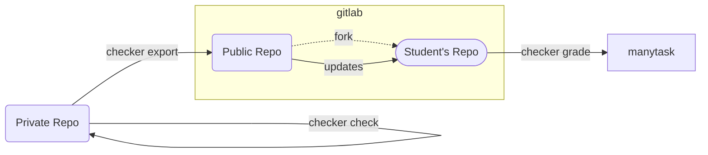

# Manytask Checker

[](https://github.com/manytask/checker/actions/workflows/test.yml)
[](https://github.com/manytask/checker/actions/workflows/publish.yml)
[](https://codecov.io/gh/manytask/checker)
[](https://github.com/manytask/checker/releases)
[](https://pypi.org/project/manytask-checker/)


Checker is a Python cli script to test students' solutions with built-in [manytask](https://github.com/yandexdataschool/manytask) integration.

* **production-like** - setup for students with gitlab-ci, language-specific testing etc 
* **customizable** - testing pipeline configuration via yaml files
* **extensible** - build-in plugins and ability to write custom plugins
    * [manytask](https://github.com/manytask/manytask) integration with plugin
    * gitlab merge-requests checks with plugin
    * etc
* **secure** - sandbox execution of students' code
* **fast** - lightweight script with testing parallelization

`Requires Python 3.10+`

---


## How it works 

The `checker` lib is a part of the `manytask` ecosystem and extends its functionality.  
Please refer to the [manytask](https://github.com/manytask/manytask) documentation first to understand the drill.

> tl;dr: Manytask is a web application to manage students', repos, grades and deadlines.  
> It stores grades in google sheet and deadlines on a web page.  
> It also automatically creates gitlab repositories for students as forks from Public Repo with tasks and solution templates.  

So you have `Public Repo` and `Students' Repositories` and `Web App` to collect grades and deadlines.  

---

For the checker this setup extends with `Private Repo` with tasks, tests and solutions and `gitlab-ci` to run tests in.

The `checker` in a nutshell is a CLI script providing the following functionality:  

* **grade** - to run in a student's repository to test solution against private and public tests and push scores.
* **validate** - to run in a private (tutors') repository to validate tasks and deadlines integrity (will run in check automatically).
* **check** - to run in a private (tutors') repository to test gold solutions against private and public tests.
* **export** - to run in a private (tutors') repository to export tasks, templates and tests to the public repository.



The flow for tutors looks like:  

1. Have a manytask ready with empty public repo
2. Create private repo with tasks, tests and solutions
3. Configure checker with yaml files
4. Make docker with your environment and checker installed
5. Write ci file from students to run `checker grade` on each push/mr
6. Setup private repo ci to run `checker check` on each push/mr
7. Setup private repo ci to run `checker export` on each push/mr oor release or regularly or manually
8. Profit!

The flow for students looks like:

1. Register in manytask and get access to the public repo fork
2. Clone this repo and start working on tasks
3. Update from public repo regularly to get new tasks and tests
4. Push your solution to gitlab where `checker grade` will run and push scores
5. Profit!


It is a short description, please refer to the [checker docs](./docs) for more details.


## Installation 

The `checker` is available on pypi, so you can install it with pip
```shell
pip install manytask-checker
```

Or use pre-built docker image (you can base your image on it)
```shell
FROM manytask/checker:0.0.1-python3.12
```
Please check [docker hub](https://hub.docker.com/r/manytask/checker) for available tags.


## Contributing

Really appreciate any contributions!  
For guidance on setting up a development environment see the [development guide](./docs/6_development.md).
For styleguide see organization [contribution guide](https://github.com/manytask/.github/CONTRIBUTING.md).

