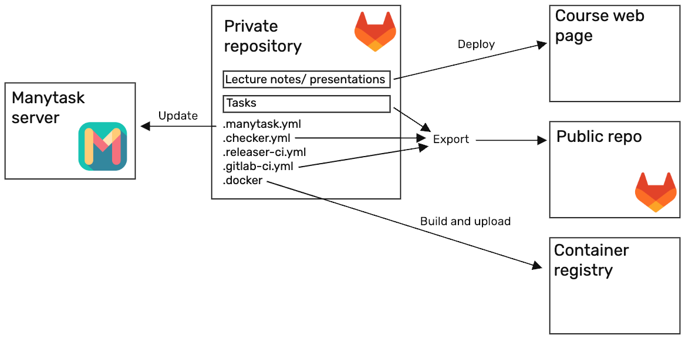

# Concept

## Course as a code

From the teacher's point of view, the general idea of Manytask project can be summarized as Course as a Code. For the teacher, all the tasks, their solutions, descriptions, build environment, run environment and deadlines are stored in a single private repository. When teacher pushes to this repository, new or updated tasks, lecture notes, deadlines are updated for students while teachers solutions and private tests are not revealed. The later stage can be automated, in which case teacher only interacts with the private repository, updating the course materials, setting the deadlines and revealing new tasks as the course progresses.

Students interact with the course through their own fork of a stripped 'public' version of the private repository (see below). When they submit their solutions, they are tested using standard GitLab CI/CD pipeline. On success, the result is reported to Manytask web app. Later accumulate scores, showing the students their progress.

### The private repository:

The private repository contains:

1. Tasks for students with private teachers solutions, public and private test.
2. Docker file with the all the environment, needed for running tests.
3. Configuration of the course that lists the tasks with their respective deadlines.
4. Configuration .yml files that separate private and public parts of the repo.
5. CI/CD file with pipelines for creating containers and pushing them to the registry, updating the Manytask web app and public repository with new tasks/deadlines.

Private repository contains the course entirely, teacher should only care about information in this repository. They should create new repository for the new course, add or update tasks as the course progressed. Normally, the course is updated from one iteration to the other, which is done using standard practice of code development (either by updating the main branch directly or through the Pull/Merge requests).

### Public repository

When private repository is updated, its public counterpart can be updated as well. The public repo is derived completely from the private repository, does not have the teacher's solutions and can be lacking some tests (which are still used in testing students solution, but are not revealed to the student). When public repo is updated, students can get new task by pulling changes to their fork. Teachers can also control which tasks are revealed to the students, adding tasks as the course progresses.

### Course as viewed by students

While taking course, student interacts with their own fork of a public repository and which is developed into a complete project as the course progresses and student solves separate tasks. This teaches the student to work in standard development environment (i.e. sending their solutions to a git repository) as they are guided through a series of tasks, which can be parts of a big projects.

# Manytask web app

The central part of the concept is Manytask web app. It handles all the course logic: from maintaining access to the course to store the score for each task and each student. The app uses the REST API to interact with the rest of the components (i.e. when course tasks or deadlines are updates, or student completed the task and points should be assigned).
