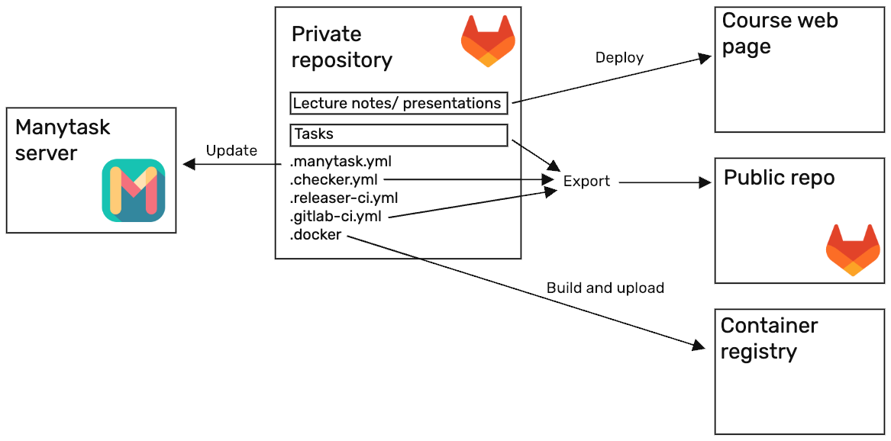
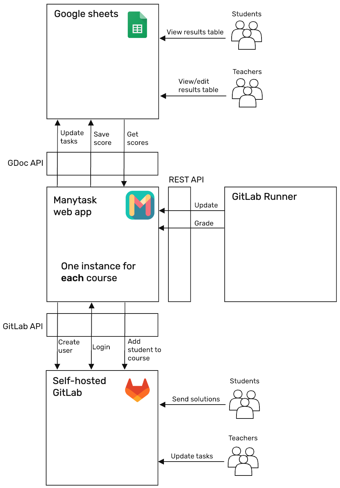
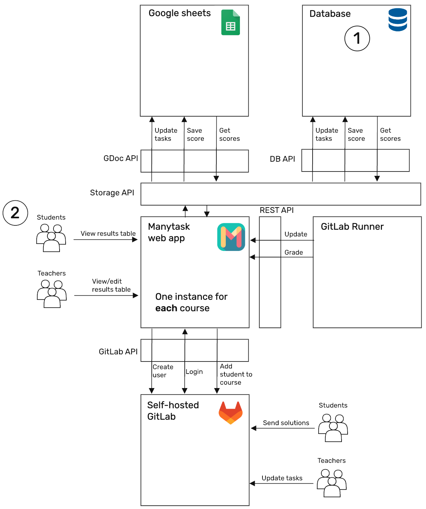
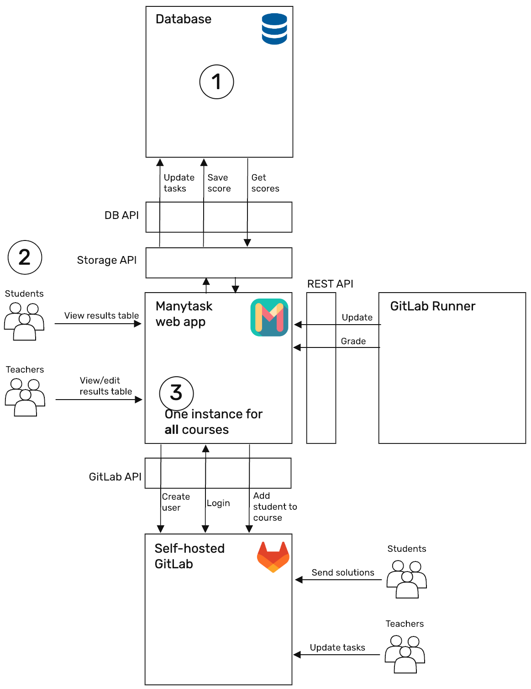
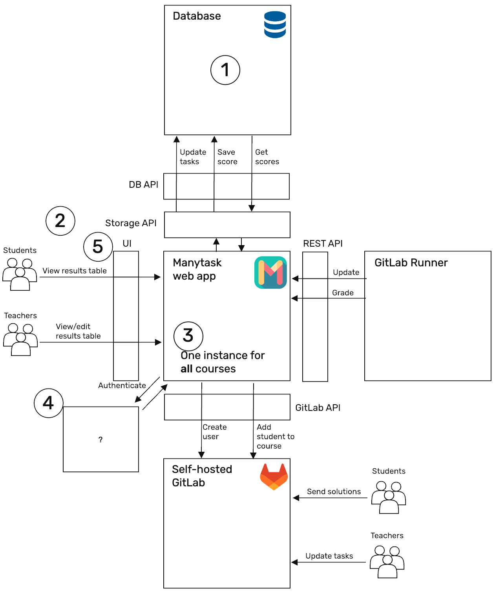

# Concept

## Course as a code

The general idea of Manytask project can be summarized as Course as a Code. For the teacher, all the tasks, their solutions, descriptions, build environment, run environment and deadlines are stored in a single private repository. When teacher pushes to this repository, new or updated tasks, lecture notes, deadlines are updated for students while teachers solutions and private tests are not revealed. The later stage can be automated.

Students interact with the course through their own fork of a stripped 'public' version of the private repository (see below). When they submit their solutions, they are tested using standard GitLab CI/CD pipeline. On success& the result is reported to Manytask web app. Later accumulate scores, showing the students their progress.

### The private repository:

The private repository contains:

1. Tasks for students with private teachers solutions, public and private test.
2. Docker file with the all the environment, needed for running tests.
3. Configuration of the course that lists the tasks with their respective deadlines.
4. Configuration .yml files that separate private and public parts of the repo.
5. CI/CD file with pipelines for creating containers and pushing them to the registry, updating the Manytask web app and public repository with new tasks/deadlines.

Private repository contains the course entirely, teacher should only care about information in this repository. They should create new repository for the new course, add or update tasks as the course progressed. Normally, the course is updated from one iteration to the other, which is done using standard practice of code development (either by updating the main branch directly or through the Pull/Merge requests).

### Public repository

When private repository is updated, its public counterpart can be updated as well. The public repo is derived completely from the private repository, does not have the teacher's solutions and can be lacking some tests (which are still used in testing students solution, but are not revealed to the student). When public repo is updated, students can get new task by pulling changes to their fork. Teachers can also control which tasks are revealed to the students, adding tasks as the course progresses.

### Course as viewed by students

While taking course, student interacts with their own fork of a public repository and which is developed into a complete project as the course progresses and student solves separate tasks. This teaches the student to work in standard development environment (i.e. sending their solutions to a git repository) as they are guided through a series of tasks, which can be parts of a big projects.

The general milestone of current development is to simplify the process of creating course for the teacher by (1) reducing technical difficulties of creating course by centralizing the setup of most of the connections between part of Manytask system and (2) providing the repository templates for most of the programming languages (perhaps, make a universal repo that can handle many different languages).

# Manytask web app

The central part of the concept is Manytask web app. It handles all the course logic: from maintaining access to the course to store the score for each task and each student. The app uses the REST API to interact with the rest of the components (i.e. when course tasks or deadlines are updates, or student completed the task and points should be assigned). In current version, app uses Google sheets as a database for scores and relies on GitLab to authorize users access. The major limitation of the current version is that one instance can only handle one course. Because of that, a lot of effort is needed when the course is started, including technical work of connecting all the part involves with each other (Manytask with Google Sheets and GitLab).

## The proposed development for the Manytask web app can be split into the following stages:

### Stage 0. Current state of the app.

Current version of Manytask relies on Google spreadsheet to store the student scores and tasks. The deadlines are stored on a file system. There are some advantages in such an approach: one can easily access and edit score for a given task and student, manipulate data with scripts and formulas. However, this approach can not be further elaborated because it requires single table per course. Also this approach is vulnerable to any significant change in the API and to an ability to create and use service accounts (e.g. for specific types of users or from specific countries or regions).

### Stage 1 Create the database that can store the information on the course, including tasks, scores.

The solution is to move to a proper database. The initial design should be able to do exactly what the Google spreadsheet is doing, so that it can be used in exactly the same scenarios. Also this should allow to use working Google Sheets approach as a test bench, since it follows the behavior that we want from the system.

The result of the first stage should be a working web app the can be configured to use either a google sheet or a database. One instance of the web app should be able to serve only one course. If the database is selected as a storage, the possibility to interact with it should be implemented on stage 2.

### Stage 2. Add the interface that allows to see the score table

Most important advantage of using Google Sheets as a database is in ability to see and interact with the data in many different ways. The table can be shared with the students in view-only mode so that they can see the scores and compare their progress with others. Teacher can edit the table if they want to override the auto-checker (e.g. when student was on a sick-leave). Also the teacher can add formula to compute the final score from the points student has accumulated. Switching to database remove these features.

Since plain database does not provide such an interface, the options of (1) using universal database view or (2) implementing these interfaces should be considered and evaluated.

### Stage 3. Make it possible to serve several courses by one instance of Manytask

The next stage is to make it possible to use single Manytask app to serve several courses (and course iterations). This should significantly simplify the setup of the course since all the API connections are set up for the entire application (i.e. once) and adding the course will use these pre-set connections.

### Stage 4. Use separate service to handle user authorizations (stop relying on GitLab)

Currently, GitLab handles the users credentials. Hence it is responsible for two completely separate things: (1) handles student repositories and (2) authorizes access

### Stage 5. Update the UI

Current UI is outdated and and adding more functionality is problematic. Hence, a re-write based on one or another UI framework is needed. This will improve the visual feel of the app and will allow to create additional features, such as user rating, comparison between courses, more clear representation of the user progress.