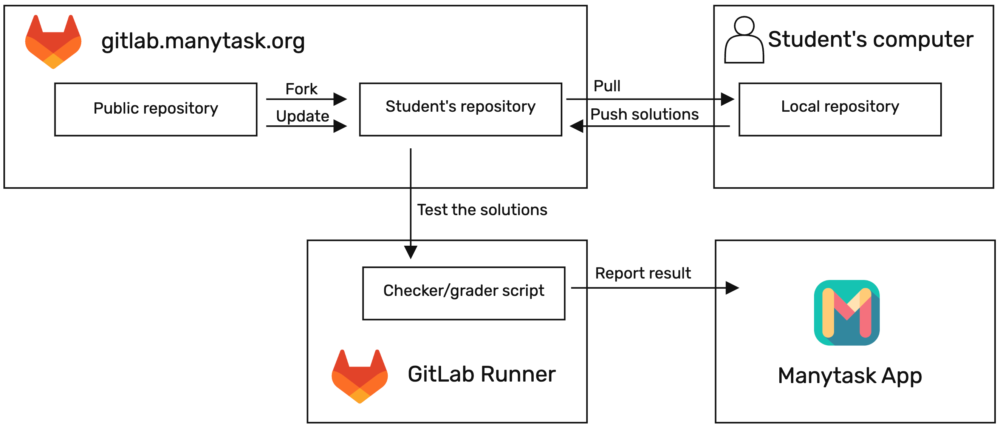

# How it works

Manytask was created to automate grading for coding courses and to introduce learners to popular development tools right away: git, GitLab CI, and other language-specific tools.



From the student's point of view, the Manytask consists of the following parts:
- **The Manytask web app ([app.manytask.org](app.manytask.org))**. Here you can see the courses, you are registered to, available tasks, deadlines, and your points on each task of each course. When you solve tasks, this is reported to Manytask so that yourself and your teacher can see your progress.
- **GitLab Instance ([gitlab.manytask.org](gitlab.manytask.org))**. Our GitLab instance where your personal remote repository, the course public repository, and the grading pipelines live. You will mostly interact with GitLab when submitting existing tasks and getting new ones, and you will use GitLab native tools to do so.
- **Public repository.**. The repository with all the task currently issued by the teacher. This repository will be updated with new tasks as the course progresses. Keep an eye on it and check if your fork is up-to-date.
- **Students repository.** This is your personal fork of public repository that will be created automatically when you register to course. You will submit your solution to this repository and CI/CD will verify that the solution passes all the checks.
- **Your personal local repository.** Although it is possible to submit tasks directly from the GitLab web-interface, it is much more convenient to have a local copy of your repository. This way you can use your favorite IDE or text editor, run linters, type-checkers and tests locally, before you submit your solution.
- **GitLab Runner (https://docs.gitlab.com/runner/).** Every time one submits the solution, a runner picks it up for testing. The list of checks that runner performs depends on the course, but normally they are not limited to tests: they shall be similar to production environment for the programming language used in the course. Once and if the checks are successful, the result will be reported and you will get points for your solution.

## Steps to start solving

### 1. Register on app.manytask.org or sign-in

Fill-in the registration form at [app.manytask.org](app.manytask.org). Provide your first and last name so that we can identify you when time comes to transfer grades to LMS of your institution.

**What will happen:** After you submit the form, a user will be created in Manytask and on GitLab and you will be redirected to GitLab for login. This is because Manytask uses GitLab as an authorization provider. Enter the same login/password on GitLab login page and you should be ready to register for a course.

If you already had an account, you can click on sign-in button. In this case, you many be asked to provide first and last name on a separate form if we don't have them. This is needed for your profile: GitLab uses only one field for the name and there is no guarantee that it can be properly parsed to the first and last names.

### 2. Register for a course

After you logged in, you will see a list of courses you are currently registered to. Chances are, you don't have any yet and you want to register for one. To do so, you need the name of the course and a secret. Normally, you can find those in LMS or from a teacher. Once registered, you will be redirected to the course main page, where all the current tasks and deadlines are shown. From this page you can navigate to your fork on GitLab or see the table with scores of all students on course.

**What will happen:** When you register for a course, a fork of a public repository for this course will be created automatically. This fork will contain all the materials needed to solve current tasks on the course, it will not be updated automatically - you will need to keep track that your fork is up-to-date with the public repository. Usually, the course has a simple first task to make sure everything works.

### 3. Solve a task

Note that the mechanics on how to submit tasks may differ from course to course and you should consult documentation on the course itself fot the specifics. Normally, you can find step-by-step instructions in README.md file in the root of the public repository (or your fork of the public repository).

From the course page, navigate to the GitLab page and find a task to solve there. Read the problem statement and find a place where you should write your code, usually it is marked with ``Insert your code here``, etc. For simple tasks, you can edit the code in the GitLab web-interface and commit your changes directly to your fork.

**What will happen:** After you committed changes to the repo, CI/CD will pick up. It will search for the changes in the code to identify what task was submitted for grading. After that, the checks will start and in case they pass, the score will be reported back to Manytask. You should see the points appear on the course page and the color of the task should also change. Note that grading pipeline can contain many stages, including e.g. linters and typecheckers. Even if your code pass tests it still can fail, for instance, on code style.

### 4. Set up local environment

Although it is possible to submit simple tasks using GitLab web-interface, it will become harder as the tasks become more complex. Besides, did you see a developer who writes code in the web interface? Hence, you will need to set up local environment for writing code and submitting tasks. How to do so depends drastically on the programming language the course uses, but there are certain common steps.

#### Create and export your public key to GitLab

When you log into GitLab for the first time, you will be greeted with a message that you should add ssh key. To generate and add the key, you can follow instructions from this [GitLab tutorial](https://docs.gitlab.com/ce/user/ssh.html).

#### Install git

On Ubuntu/Debian (including WSL):
```
sudo apt-get install git
```
On MacOS:
```
brew install git
```

#### Clone your fork of the public repository

Chose a working directory and change path to it:
```
cd <working directory>
```

Clone you fork of a public repo to the local directory. You can find full link on the web-interface of GitLab, if you navigate to the root of your fork. Look for blue button with ``Code`` label. Use ``Clone with SSH`` link - it should work if you added SSH key correctly.
```
git clone git@gitlab.manytask.org:<path to your fork of a public repo>
```

Change path to your repo:
```
cd <your username>
```

Set up git credentials (use login and email that you provided when registering to Manytask):
```
git config --local user.name "<your login in Manytask>"
git config --local user.email "<your email in Manytask>"
```

#### Solve and submit a task

Before submitting the task, you should compile you code and run all the checks locally. These depends on the course, so you should consult the instructions on the course.

Solve a task locally and commit your changes:
```
git commit <task_file> -m "Solve task 123"
```
Push the changes to your remote fork:
```
git push origin main
```

The CI/CD should start and you will get points in case of success.